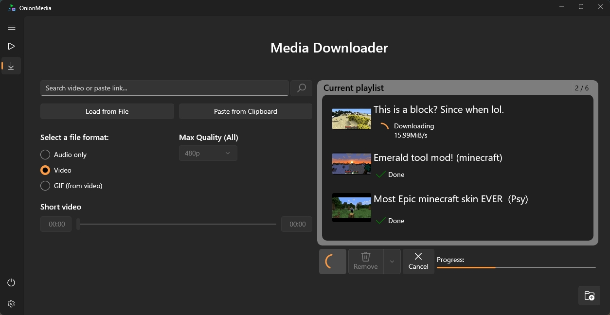
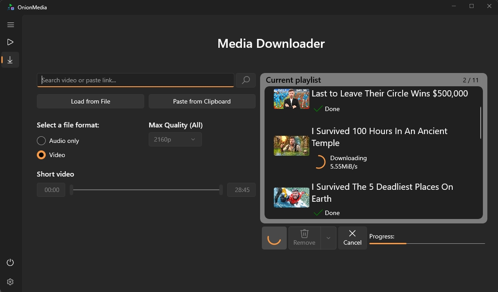

# OnionMedia Batch

> This is a fork of [OnionMedia]([https://github.com/original/project](https://github.com/onionware-github/OnionMedia))
> by Jaden [onionware-github](https://github.com/onionware-github).
> Maintained by: Kustrica.
> Licensed under AGPL-3.0.

## What’s new in this fork
- Added a counter showing the number of downloaded links out of the added ones
- Added support for downloading multiple videos from a file or clipboard
- Added an import progress bar

## New Features
| Download Counter | Import Progress |
|:---:|:---:|
|  |  | 

## Installation Guide:
1. Download the latest release (`.zip`) and extract it.
2. Open the extracted folder (e.g., `OnionMedia_xx`).
3. Double-click on `install.bat`.
4. A PowerShell window will open. Follow the instructions (you may need to press Enter or type 'Y' to proceed with certificate installation).
5. After successful installation you can find the app in the **Start Menu** by searching for "OnionMedia".

**Note:** You may be prompted to enable **Developer Mode** in Windows Settings. If the Settings app opens, simply toggle "Developer Mode" to **On**, then return to the PowerShell window to continue installation.

**Development Setup**

If you want to build this project from source, you need to download the required external binaries (FFmpeg and yt-dlp) first.

1.  Clone the repository.
2.  Run the `setup_dependencies.ps1` script in the root folder. You can do this by opening PowerShell in the root directory and running:
3.  
    ```powershell
    PowerShell -NoProfile -ExecutionPolicy Bypass -Command "& '.\setup_dependencies.ps1'"
    ```
4.  Open `OnionMedia.sln` in Visual Studio 2022.
5.  Build and Run.

## 
## 
# OnionMedia

You use Linux? Check out [OnionMedia X](https://github.com/onionware-github/OnionMedia-X)!

<a href="https://github.com/onionware-github/OnionMedia/blob/main/images/icon.svg">
  
</a>

Converts and downloads videos and music quickly and easily.

[Overview](#overview) • [Features](#features) • [Download](#download-and-installing) • [Releases](https://github.com/onionware-github/OnionMedia/releases) • [Discord](https://discord.gg/3ahqCzQxs8) • [Info](#info)

## Overview

You're looking for a simple solution to convert, recode, trim or even download media files and do it as easily as possible with many customizable options?

Then OnionMedia is the right choice for you.
It offers a simple and adaptive user experience and also adapts to your chosen Windows theme.
So it fits perfectly into your system as an almost native app.


Download multiple videos and audios at the same time from many platforms with just a click.
OnionMedia delivers a built-in Searchbar for Youtube, functions to recode your downloaded videos to the H.264 codec after download and lets you get shortened videos if you want.

## Features

- #### Converting files
  - Recode to other video and audio codecs.
  - Hardware-Accelerated-Encoding for video files.
  - Change resolution, aspect ratio, bitrates and frames per second.
  - Short the file and get only a part instead of the full content.
  - Edit the Tags from files (e.g. Title, Author, Album...)

- #### Downloading files
  - Supports many platforms
  - Search videos or add them directly with an URL.
  - Add multiple videos to the queue and download them at the same time.
  - Lets you select a resolution to download the video, or download only the audio of the file.
  - Recode the video after download directly to H.264

- #### Other
  - Adapts to the selected Systemtheme and Accent Color in Windows
  - Completely free and Open-Source

## Download and installing

#### Download from Microsoft Store
You can find OnionMedia in the Microsoft Store, that is preinstalled in Windows 10 and Windows 11.

<a href="https://apps.microsoft.com/detail/OnionMedia%20-%20Videodownloader%20und%20Konverter/9n252njjqb65?launch=true
    &mode=mini">
    
</a>


#### Download directly from GitHub
[Go to the Releases page and find all releases of OnionMedia to download!](https://github.com/onionware-github/OnionMedia/releases)


## Info
Copyright © Jaden Phil Nebel
###### OnionMedia is Free Software and is based on the awesome tools ffmpeg and yt-dlp for converting and downloading files.

<a href="https://ffmpeg.org/">
  
</a>


<a href="https://github.com/yt-dlp/yt-dlp">
  
</a>
<br/><br/><br/>
Looking for a reliable video downloader on Android? Check out <a href="https://github.com/JunkFood02/Seal">Seal</a> from <a href="https://github.com/JunkFood02">JunkFood02</a>!

## More information
You still have open questions? [Join our Discord Server](https://discord.gg/3ahqCzQxs8)
